# UI Design Overhaul & Creator Page - Complete Deliverables

**Project:** FitAI - AI-Powered Fitness App  
**Date:** October 7, 2025  
**Status:** ✅ Complete - Ready for Implementation

---

## 📋 Executive Summary

This comprehensive UI/UX audit and redesign addresses critical issues in the FitAI app:
- **8 bottom tabs** reduced to **5** (platform guidelines)
- **6 duplicate features** eliminated
- **3 blank screens** filled with real content
- **Creator experience** completely redesigned with clear hierarchy
- **Design system** formalized with tokens and component specs

**Result:** **27 screens → 21 screens** (22% reduction), clearer information architecture, and production-ready Creator Studio.

---

## 📦 Deliverables

### 1. Core Documentation

| File | Description | Status |
|------|-------------|--------|
| [`audit.md`](./audit.md) | Complete UI audit with heuristic review, accessibility findings, and Top 10 Fixes | ✅ Complete |
| [`screens.csv`](./screens.csv) | Screen inventory with status, issues, and recommendations | ✅ Complete |
| [`ia-map.mmd`](./ia-map.mmd) | Information architecture map (Mermaid diagram) showing 5-tab structure | ✅ Complete |

### 2. Design System

| File | Description | Status |
|------|-------------|--------|
| [`design-system.md`](./design-system.md) | Component specs, usage rules, do's/don'ts with screenshots | ✅ Complete |
| [`tokens.json`](./tokens.json) | Design tokens (colors, spacing, typography, shadows) in JSON format | ✅ Complete |
| [`copy.md`](./copy.md) | Complete copy deck for all screens (buttons, errors, empty states) | ✅ Complete |

### 3. Creator Experience

| File | Description | Status |
|------|-------------|--------|
| [`creator-spec.md`](./creator-spec.md) | Production-ready Creator Studio spec with component code | ✅ Complete |

### 4. Cleanup & Implementation

| File | Description | Status |
|------|-------------|--------|
| [`cleanup-plan.md`](./cleanup-plan.md) | De-duplication plan with migration steps and acceptance tests | ✅ Complete |
| [`qa-checklist.md`](./qa-checklist.md) | Release-ready QA checklist (visual, a11y, performance, functional) | ✅ Complete |
| [`tickets/`](./tickets/) | Implementation tickets broken down by feature | ✅ Complete |

---

## 🎯 Key Findings

### Problems Identified
1. **Navigation Overload:** 8 tabs (recommended max: 5) causing cognitive overload
2. **Feature Duplication:** Plans = Workouts, CoachChannel = CoachProfile, etc.
3. **Incomplete Screens:** CreatorDrafts, CreatorAnalytics, VoiceWorkout blank or minimal
4. **Creator Confusion:** Features split between Creator tab + Profile "Create & Share"
5. **Accessibility Issues:** 11 issues (missing labels, small touch targets, poor contrast)

### Solutions Delivered
1. ✅ **5-Tab Navigation:** Home | Discover | Create | Progress | Profile
2. ✅ **Merged Duplicates:** Plans→Workouts, CoachChannel→CoachProfile
3. ✅ **Filled Blanks:** Real content specs for all empty states
4. ✅ **Unified Creator:** Single Creator Studio with clear hierarchy
5. ✅ **Accessibility Fixes:** Touch targets ≥48pt, WCAG AA contrast, screen reader labels

---

## 🏗️ Proposed Information Architecture

```mermaid
graph TB
    Start[App Launch] --> Auth{Logged In?}
    Auth -->|No| AuthScreen[Auth Screen]
    Auth -->|Yes| Main[Main App - 5 Tabs]
    
    Main --> Home[🏠 Home]
    Main --> Discover[🔍 Discover]
    Main --> Create[✨ Create]
    Main --> Progress[📊 Progress]
    Main --> Profile[👤 Profile]
    
    Home --> Nutrition[Nutrition Widget → Full Screen]
    Home --> Workouts[Workout Widget → Full Screen]
    
    Create --> CreatorHub[Creator Studio]
    CreatorHub --> Published[Published Tab]
    CreatorHub --> Drafts[Drafts Tab]
    CreatorHub --> Scheduled[Scheduled Tab]
```



**Key Changes:**
- Nutrition & Workouts accessible via Home widgets (not separate tabs)
- Creator unified into single "Create" tab
- Plans merged into Workouts
- All screens reachable within 2-3 taps

---

## 🎨 Design System Highlights

### Color Tokens
```json
{
  "background.primary": "#0A0A0F",
  "text.primary": "#FFFFFF",
  "accent.primary": "#00FFFF",
  "accent.success": "#00FF66",
  "accent.error": "#FF0055"
}
```

### Spacing Scale (4pt grid)
```
xs: 4pt, sm: 8pt, md: 12pt, lg: 16pt, xl: 24pt, xxl: 32pt, xxxl: 48pt
```

### Typography
```
Title: 40pt/700
H1: 32pt/700
H2: 24pt/700
Body: 16pt/400
Caption: 12pt/400
```

### Components Defined
- Button (4 variants: primary, secondary, outline, ghost)
- Card (with header, content, footer sections)
- Input (with error states and labels)
- Empty State (icon, title, subtitle, CTA)
- Post Row (for Creator content lists)
- Metric Pill (for stats display)

---

## ✨ Creator Studio Redesign

### Before (Problems)
- ❌ Duplicate sections ("Drafts" and "Drafts 2")
- ❌ Blank screens (no real content)
- ❌ Mock data hardcoded in JSX
- ❌ Unclear hierarchy (too many "Add Block" buttons)
- ❌ Split between Creator tab + Profile upload section

### After (Solution)
- ✅ Clear hierarchy: Header → Stats → Create CTA → Content Tabs → Toolbox
- ✅ Real API data (no mocks)
- ✅ Empty states with helpful copy + CTAs
- ✅ Unified content creation (single "Create" button)
- ✅ Segmented control: Published | Drafts | Scheduled

**Components Provided:**
- `CreatorHeader.tsx` - Avatar, handle, verified badge, settings
- `MetricPill.tsx` - Stat display (followers, views, earnings)
- `PostRow.tsx` - Content list item with thumbnail, metadata, menu
- `EmptyState.tsx` - Empty state with icon, copy, CTA

---

## 📊 Metrics & Acceptance Criteria

### Success Metrics
| Metric | Before | Target | Method |
|--------|--------|--------|--------|
| Tab count | 8 | 5 | Count tabs in TabNavigator |
| Screen count | 27 | 21 | Count files in src/screens/ |
| Duplicate features | 6 | 0 | Manual audit |
| Blank screens | 3 | 0 | Manual audit |
| A11y issues | 11 | 0 | VoiceOver/TalkBack test |
| Touch target fails | ~15 | 0 | Measure <48pt buttons |

### Acceptance Criteria (Must Pass Before Ship)
- [ ] Bottom tabs = 5 exactly
- [ ] No duplicate screens (Plans, CoachChannel removed)
- [ ] No blank screens (Drafts, Analytics filled)
- [ ] Creator Studio matches spec (header, stats, tabs, empty states)
- [ ] All touch targets ≥48×48pt
- [ ] All text WCAG AA contrast
- [ ] All interactive elements have accessibilityLabel
- [ ] First meaningful paint <1s on key screens
- [ ] App builds on iOS & Android without errors
- [ ] All QA checklist items pass

---

## 🚀 Implementation Plan

### Phase 1: High Priority (Week 1)
1. **TICKET-001:** Reduce tabs from 8 to 5
2. **TICKET-002:** Merge Plans into Workouts
3. **TICKET-003:** Creator Hub redesign (components + screen)
4. Remove Profile "Create & Share" section

**Estimated Effort:** 5 days (1 week)

### Phase 2: Medium Priority (Week 2)
5. Remove CoachChannelScreen → Keep CoachProfile
6. Remove CreatorDraftsScreen → Use CreatorHub Drafts tab
7. Fill CreatorAnalyticsScreen with real content
8. Merge CreatorProfileEditor into ProfileScreen

**Estimated Effort:** 3 days

### Phase 3: Low Priority (Week 3)
9. Clarify ProgramDetail vs ProgramTemplate
10. Remove VoiceWorkoutScreen (if feature not planned)
11. Accessibility fixes (11 issues)
12. Performance optimizations

**Estimated Effort:** 4 days

**Total Estimated Effort:** 12 days (2.5 weeks)

---

## 📖 How to Use These Deliverables

### For Designers
1. Read [`design-system.md`](./design-system.md) for component specs
2. Use [`tokens.json`](./tokens.json) in Figma (import as variables)
3. Refer to [`creator-spec.md`](./creator-spec.md) for Creator Studio mockups
4. Use [`copy.md`](./copy.md) for all microcopy

### For Developers
1. Start with [`tickets/`](./tickets/) folder - implement in order
2. Reference [`creator-spec.md`](./creator-spec.md) for component code (copy-paste ready)
3. Use [`design-system.md`](./design-system.md) for styling guidelines
4. Follow [`cleanup-plan.md`](./cleanup-plan.md) for refactoring steps
5. Run through [`qa-checklist.md`](./qa-checklist.md) before shipping

### For Product Managers
1. Read [`audit.md`](./audit.md) for full context and Top 10 Fixes
2. Review [`ia-map.mmd`](./ia-map.mmd) (open in Mermaid viewer) for new nav structure
3. Check [`screens.csv`](./screens.csv) for screen-by-screen recommendations
4. Prioritize tickets in [`tickets/`](./tickets/) folder

### For QA
1. Use [`qa-checklist.md`](./qa-checklist.md) as master testing guide
2. Refer to [`creator-spec.md`](./creator-spec.md) for Creator acceptance criteria
3. Test on devices listed in QA checklist (iPhone SE, Galaxy A, etc.)
4. Verify accessibility with VoiceOver/TalkBack

---

## 📂 File Structure

```
docs/ui/
├── README.md                     ← You are here
├── top-10-changes.md             ← Before/After summary (START HERE!)
├── audit.md                      ← Full UI audit report
├── screens.csv                   ← Screen inventory
├── ia-map.mmd                    ← Information architecture diagram
├── design-system.md              ← Component specs & tokens
├── tokens.json                   ← Design tokens (JSON)
├── copy.md                       ← Complete copy deck
├── creator-spec.md               ← Creator Studio specification
├── cleanup-plan.md               ← De-duplication & removal plan
├── qa-checklist.md               ← Release-ready QA checklist
└── tickets/
    ├── TICKET-001-reduce-tabs.md
    ├── TICKET-002-merge-plans-workouts.md
    ├── TICKET-003-creator-hub-redesign.md
    ├── TICKET-004-fix-discover-screen.md     ← NEW (based on screenshots)
    └── TICKET-005-improve-home-dashboard.md  ← NEW (based on screenshots)
```

---

## 🎓 Design Principles Applied

1. **Native-First:** Followed iOS HIG + Material guidelines (touch targets, typography, shadows)
2. **Accessibility:** WCAG AA contrast, ≥48pt touch targets, screen reader labels
3. **Performance:** <1s first paint, lazy loading, pagination
4. **No Mock Data:** All specs use real API endpoints and sample data
5. **Real Copy:** No lorem ipsum - every string is production-ready
6. **Consistency:** All components use design tokens (no hardcoded values)

---

## ✅ Completion Checklist

- [x] UI Audit Report (screens, duplicates, broken flows, heuristics, a11y)
- [x] Screen Inventory CSV (27 screens with status)
- [x] Information Architecture Map (5-tab structure)
- [x] Design System Documentation (components, tokens, usage rules)
- [x] Design Tokens JSON (colors, spacing, typography)
- [x] Copy Deck (all microcopy for app)
- [x] Creator Experience Spec (production-ready with component code)
- [x] Cleanup Plan (de-duplication steps)
- [x] QA Checklist (visual, a11y, performance, functional)
- [x] Implementation Tickets (3 tickets for Phase 1)

---

## 📞 Questions or Issues?

If anything is unclear or you need additional specs:
1. Check relevant markdown file (detailed info in each doc)
2. Review component code in `creator-spec.md` (copy-paste ready)
3. Reference `design-system.md` for styling questions
4. Use `tokens.json` for exact color/spacing values

---

**Last Updated:** October 7, 2025  
**Status:** ✅ All deliverables complete and ready for implementation  
**Next Steps:** Review with team → Prioritize tickets → Begin Phase 1 implementation

---

## 🏆 Expected Impact

**User Experience:**
- 📉 Reduced cognitive load (8 tabs → 5 tabs)
- 📈 Clearer navigation (all features reachable in 2-3 taps)
- ✨ Better Creator experience (unified studio with clear hierarchy)
- ♿ Improved accessibility (11 issues fixed)

**Development:**
- 📉 22% reduction in screens (27 → 21)
- 🧹 Cleaner codebase (duplicates removed)
- 📦 Reusable components (Button, Card, EmptyState, etc.)
- 🎨 Consistent design (all using tokens)

**Business:**
- 📈 Higher creator retention (better tools)
- 📈 Increased content creation (easier workflow)
- 📉 Lower support costs (clearer UI = fewer questions)
- 🚀 Faster feature development (design system in place)

---

**Let's ship it! 🚀**

